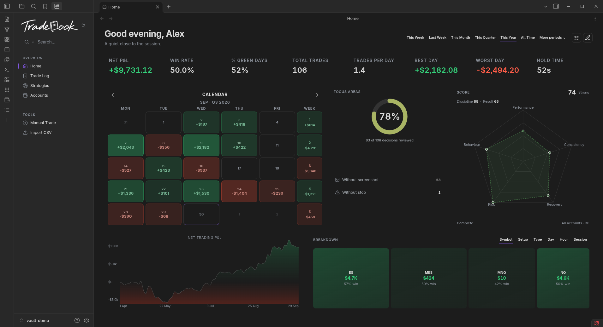

<div align="center">
  <picture>
    <source media="(prefers-color-scheme: dark)" srcset="assets/readme/logo-white.png">
    
  </picture>
  <h3>A local, private futures journal for Obsidian.</h3>
  <p>
    <a href="#features">Features</a> &nbsp;·&nbsp;
    <a href="#install">Install</a> &nbsp;·&nbsp;
    <a href="#getting-started">Getting started</a> &nbsp;·&nbsp;
    <a href="ROADMAP.md">Roadmap</a> &nbsp;·&nbsp;
    <a href="#support">Support</a>
  </p>
</div>

<p align="center">
  <a href="https://github.com/yamihugo/Tradebook"></a>
  <a href="LICENSE"></a>
</p>

<div align="center">
  
</div>

**Tradebook** records what you actually did. Your trades are plain Markdown notes in your vault — no account, no cloud, no telemetry. It reports the numbers; it never blocks a trade, imposes a rule or holds anything back.

## Features

- **Import your broker's CSV** — Tradovate Orders/Fills; fills are paired FIFO and the broker's stops and targets are read from the export.
- **Accounts that mean something** — eval · funded · demo, with firm logos, their real rules and limits, and copy groups.
- **A ledger you can review** — the Trade Log and a Trade Detail page; one word closes a decision (**Reviewed**).
- **A Home that reads your trading** — net P&L curve, calendar heatmap, focus areas and a trading score.
- **Local and private** — Markdown in your vault; nothing leaves your computer, no internet connection required.

## Install

Tradebook is a plugin for [Obsidian](https://obsidian.md), installed and kept up to date through [BRAT](https://tfthacker.com/BRAT). It runs on desktop and mobile, needs no account, and works offline.

If you don't use Obsidian yet, start at step 1. If you already do, skip to step 2.

### 1. Install Obsidian

Download Obsidian **1.7.2 or newer** from [obsidian.md](https://obsidian.md) and open a vault — a new, empty vault is fine.

### 2. Install BRAT

Open *Settings → Community plugins*. If **Restricted mode** is on, turn it off first; Obsidian loads no community plugin until you do. Then select **Browse**, search for **BRAT**, and choose **Install**, then **Enable**.

### 3. Add Tradebook

Open the command palette (`Ctrl/Cmd+P`) and run **BRAT: Add a beta plugin for testing**. Paste this repository and confirm:

```
yamihugo/Tradebook
```

BRAT downloads the latest release and lists the plugin for you.

### 4. Enable and open

Back in *Settings → Community plugins*, turn on **Tradebook**. Open it from the ribbon icons or the command palette:

| Command | What it opens |
| --- | --- |
| `Tradebook: Open Home` | Your dashboard — P&L curve, heatmap, score |
| `Tradebook: Open Accounts` | Account cards and dashboards |
| `Tradebook: Open Trade Log` | The full trade ledger |
| `Tradebook: Manual Trade` | Log a trade by hand |
| `Tradebook: Import trades from CSV` | Import a broker export |

### Updating

- **Through BRAT:** run **BRAT: Check for updates**, or let BRAT update on startup.
- **Manually:** replace only `main.js`, `manifest.json` and `styles.css`.
- **Never** replace `data.json`. It holds your settings and accounts, and updating never touches your trades.

### Troubleshooting

- **Nothing loads:** confirm **Restricted mode** is off, then enable Tradebook.
- **Tradebook is not listed:** BRAT didn't finish. Run **BRAT: Add a beta plugin for testing** again and check the developer console.
- **The plugin doesn't load:** check Obsidian is **1.7.2 or newer**.
- **Restore your settings:** *Settings → Tradebook → Advanced → Import backup*, or **Restore previous settings** after an import.
- **Uninstalling deletes the plugin folder, including `data.json`.** Export a backup first from *Settings → Tradebook → Advanced → Export*.

## Getting started

1. **Add an account.** Open **Tradebook: Open Accounts** and choose **Add account**. Pick the type (eval, funded or demo), the firm, and its rules and limits.
2. **Import your trades.** Run **Tradebook: Import trades from CSV** with your broker's export. Review the preview, then import — each trade becomes a Markdown note under `<year>/<month>/trades/`.
3. **Review what you did.** Open the **Trade Log**, open a trade and mark it **Reviewed**. Home keeps score from there.

## Data and privacy

- Your trades are plain Markdown notes in your vault. Updating the plugin never touches them, and never touches `data.json`.
- Disabling the plugin keeps `data.json`; re-enabling restores everything.
- Uninstalling deletes the plugin folder, including `data.json` — export a backup first.

## Known limitations

Some numbers are modelled rather than measured (copy-trading legs; costs the broker never reported). See [KNOWN-LIMITATIONS.md](KNOWN-LIMITATIONS.md).

## Support

If Tradebook helps your trading, you're welcome to support it.

<p align="center">
  <a href="https://www.buymeacoffee.com/yamihugo"></a>
  <a href="https://ko-fi.com/yamihugo"></a>
</p>

<div align="center">
  <a href="https://star-history.com/#yamihugo/Tradebook&Date">
    
  </a>
</div>

## License

MIT — see [LICENSE](LICENSE).

Prop-firm and broker names and logos belong to their owners and are shown only to identify the firm an account trades with.
