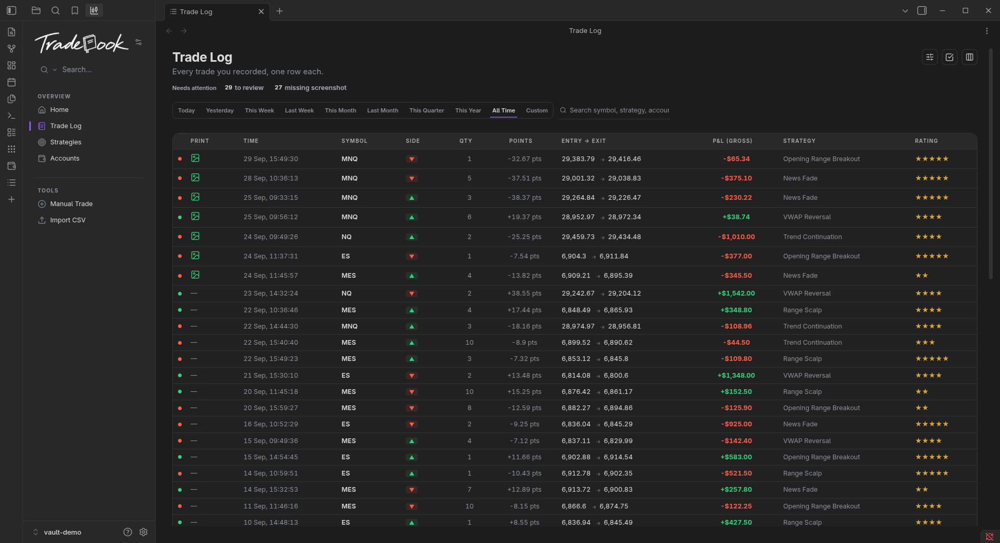
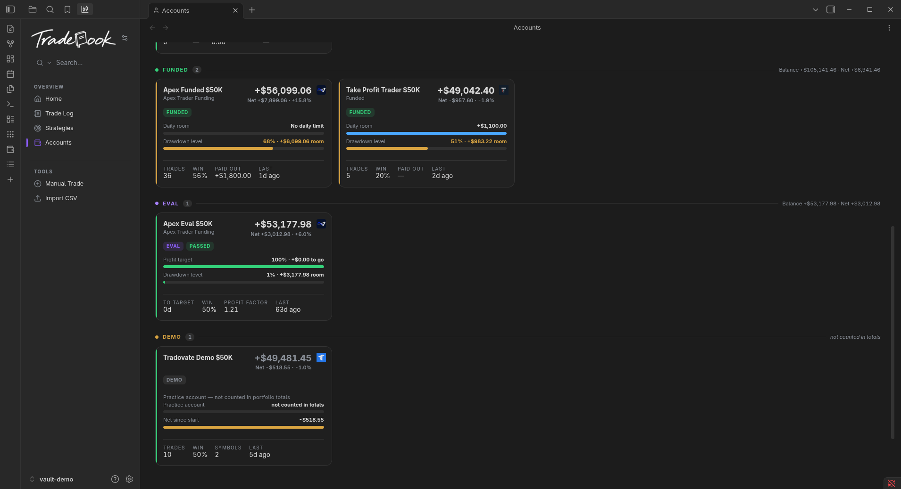

  <picture>
    <source media="(prefers-color-scheme: dark)" srcset="assets/readme/logo-white.png">
    
  </picture>
  <h3>A local, private futures journal for Obsidian.</h3>
  

    <a href="#features">Features</a> &nbsp;·&nbsp;
    <a href="#install">Install</a> &nbsp;·&nbsp;
    <a href="#support">Support</a>
  

  
  
  
  

  

**Tradebook** records what you actually did. Your trades are plain Markdown notes in your vault — no account, no cloud, no telemetry. It reports the numbers; it never blocks a trade, imposes a rule or holds anything back.

## Features

- **Import your broker's CSV** — Tradovate Orders/Fills; fills are paired FIFO and the broker's stops and targets are read from the export.
- **Accounts that mean something** — eval · funded · demo, with firm logos, their real rules and limits, and copy groups.
- **A ledger you can review** — the Trade Log and a Trade Detail page; one word closes a decision (**Reviewed**).
- **A Home that reads your trading** — net P&L curve, calendar heatmap, focus areas and a trading score.
- **Local and private** — Markdown in your vault; nothing leaves your computer, no internet connection required.

  

## Install

### Via BRAT

1. Install the [BRAT](https://tfthacker.com/BRAT) community plugin.
2. Open the command palette and run **BRAT: Add a beta plugin for testing**.
3. Paste the repository: `yamihugo/Tradebook`.
4. Enable **Tradebook** in *Settings → Community plugins*.

> On update, replace the three files (`main.js`, `manifest.json`, `styles.css`). **Never replace `data.json`** — it holds your settings and accounts.

  

## Requirements

- Obsidian **1.7.2 or newer** (desktop or mobile).
- No other plugins, no account and no internet connection required.

## Data and privacy

- Your trades are plain Markdown notes in your vault. Updating the plugin never touches them, and never touches `data.json`.
- Disabling the plugin keeps `data.json`; re-enabling restores everything.
- Uninstalling deletes the plugin folder, including `data.json` — export a backup first.

## Known limitations

Some numbers are modelled rather than measured (copy-trading legs; costs the broker never reported). See [KNOWN-LIMITATIONS.md](KNOWN-LIMITATIONS.md).

## Support

If Tradebook helps your trading, you're welcome to support it.

  
  

## License

MIT — see [LICENSE](LICENSE).

Prop-firm and broker names and logos belong to their owners and are shown only to identify the firm an account trades with.
